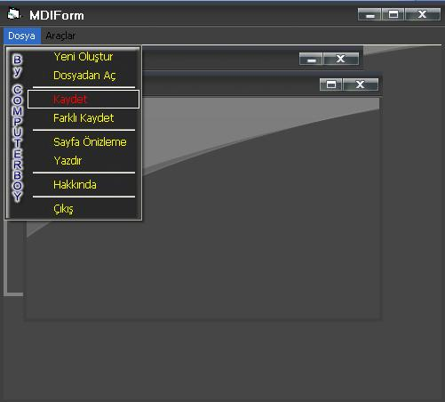



## Mdi\-Sdi Ribbon 2007 Vista Skin V 1\.03

### Description

New version, Bug Fix;

All of yours respectfully.
 
### More Info
 

             |
---                |---
**Submitted On**   |2007-08-03 11:45:36
**By**             |[Mustafa ATALAY](https://github.com/Planet-Source-Code/PSCIndex/blob/master/ByAuthor/mustafa-atalay.md)
**Level**          |Advanced
**User Rating**    |4.8 (48 globes from 10 users)
**Compatibility**  |VB 6\.0
**Category**       |[Windows API Call/ Explanation](https://github.com/Planet-Source-Code/PSCIndex/blob/master/ByCategory/windows-api-call-explanation__1-39.md)
**World**          |[Visual Basic](https://github.com/Planet-Source-Code/PSCIndex/blob/master/ByWorld/visual-basic.md)
**Archive File**   |[Mdi\-Sdi\_Ri207847862007\.zip](https://github.com/Planet-Source-Code/mustafa-atalay-mdi-sdi-ribbon-2007-vista-skin-v-1-03__1-68745/archive/master.zip)

